# Automating the Tomatometer... The Tomautometer

## Abstract
<a href="http://www.rottentomatoes.com">Rotten Tomatoes</a> is a website that rates
movies using the infamous Tomatometer.  The Tomatometer examines a collection of critic
reviews for any given film and reduces them to either a fresh (positive) or rotten
(negative) rating.  The Tomatometer score is simply the percentage of positive reviews.

For this project, I set out to automate the Tomatometer, which I have cleverly named
the Tomautometer.  The Tomautometer utilizes Natural Language Processing and
Machine Learning to predict the sentiment of language.  The model was trained on
63,367 reviews from 1,172 movies that were scraped from Rotten Tomatoes.  This document
gives an overview of the steps involved to create the Tomautometer.  To see it in action,
check out the <a href="http://ec2-54-144-4-33.compute-1.amazonaws.com:8105/">web app</a>.

## Project Scope
1. Obtain the data
2. Model Development
3. Model Investigation
4. Tomatometer Vs. Tomautomer

## Obtaining the Data
The data used for this project consists of movie review introductions obtained
from the Rotten Tomatoes website.  The screen shot below shows the review page
for the movie, Snatch.  The introductions to five reviews are shown on the right.
The top three have red tomato icons, indicating they are positive reviews, and the
bottom two have green tomato icons, indicating they are negative reviews.  The structure
of the Rotten Tomatoes review pages allowed for these review introductions to be
scraped and used in the language corpus.  The tomato icons next to each review
allowed for them to be very easily labeled good or bad.  The python script,
<a href="https://github.com/jbhersch/the_tomautometer/blob/master/src/rt_scrape.py">rt_scrape.py</a>, contains the web scraping code.  

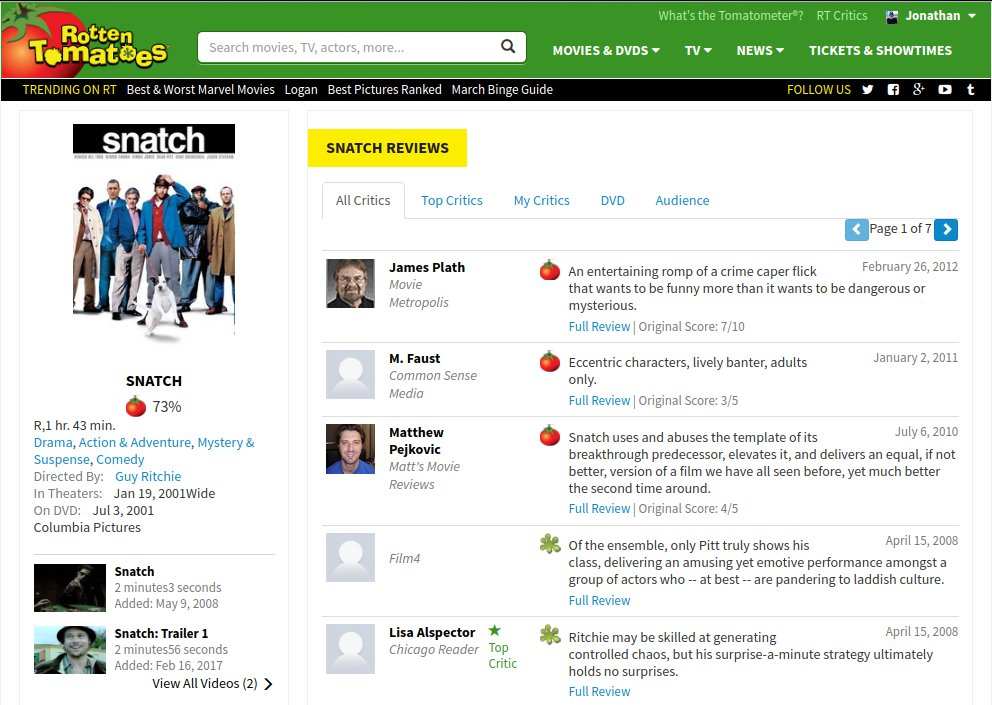
 

## Model Development
Before developing the models, the corpus was split into a training set with 80% of the data, and a testing
set with 20% of the data.  My initial plan going into this project was to use an artificial neural network
for the final sentiment model.  While I did create one, it was ultimately not the highest performing model.
Having said that, I spent much more time working on the neural network than the others, so it will be discussed
in more detail.  Another key component in the model development process was language vectorization.  The type of vectorization
varied from model to model, which is discussed below.
#### Models
##### Random Forest
The <a href="http://scikit-learn.org/stable/modules/generated/sklearn.ensemble.RandomForestClassifier.html">Random Forest </a>
model performed best with 40 trees and the
<a href="http://scikit-learn.org/stable/modules/generated/sklearn.feature_extraction.text.CountVectorizer.html">CountVectorizer</a>
using individual words alone.

The python script, <a href="https://github.com/jbhersch/the_tomautometer/blob/master/src/random_forest.py">random_forest.py</a>, was used for training and testing.
- Train Accuracy: 99.9%
- Test Accuracy: 72.1%

##### Support Vector Machine (SVM)
The <a href="http://scikit-learn.org/stable/modules/generated/sklearn.svm.SVC.html">SVM</a>
model performed best with the linear kernal function and count vectorization with individual words alone.
As seen below, it beat the Random Forest in test accuracy by roughly 4.5%.

The python script, <a href="https://github.com/jbhersch/the_tomautometer/blob/master/src/svm.py">svm.py</a>, was used for training and testing.
- Train Accuracy: 93.9%
- Test Accuracy: 76.6%

##### Naive Bayes
The <a href="http://scikit-learn.org/stable/modules/generated/sklearn.naive_bayes.MultinomialNB.html">Naive Bayes</a>
model is a multinomial Naive Bayes that uses count vectorization with words and bigrams.  

The python script, <a href="https://github.com/jbhersch/the_tomautometer/blob/master/src/naive_bayes.py">naive_bayes.py</a>, was used for training and testing.
- Train Accuracy: 97.6%
- Test Accuracy: 79.0%

##### Convolutional Neural Network (CNN)
The basis of the CNN model is an example given on
<a href="http://machinelearningmastery.com/predict-sentiment-movie-reviews-using-deep-learning/">Machine Learning Mastery</a>
used for sentiment analysis on the
<a href="http://ai.stanford.edu/~amaas/papers/wvSent_acl2011.pdf">IMDB Data Set</a>.
One aspect of using neural networks for sentiment analysis is that the language vectorization process is quite different from
the other models used.  In all the other models the scikit-learn CountVectorizer is used with varying hyper parameters.
The CNN uses popularity vectorization, where the vocabulary elements in a review are replaced with high dimensional vectors containing
integers for each element that correspond to its popularity.  In other words, the most frequently
used vocabulary element has a popularity value of one, and so on.  I found that the CNN worked most effectively when generating popularity
vectors from words and bigrams.  Similar to the other models, the CountVectorizer was used to determine the vocabulary list from
the corpus of reviews.  Once the Vectorizer was fit to the corpus, each review in the corpus can be transformed into a count vector,
and then inverse transformed into a list of vocabulary elements. From there, I created a dictionary with vocabulary elements as keys
and their respective popularity as values.  The lists of vocabulary elements corresponding to the reviews were then replaced with
lists of popularity integers obtained from the popularity dictionary.  This process is discussed in more detail in the python script,
<a href="https://github.com/jbhersch/the_tomautometer/blob/master/src/corpus_popularity.py">corpus_popularity.py</a>.

Now that the popularity vectorization process has been discussed, we can get into the structure of the CNN.
On the most basic level, the CNN is a
<a href="https://keras.io/models/sequential/">Keras Sequential model</a>.
The network is constructed with five layers:
- Embedding Layer
- Convolution Layer
- Pooling Layer
- Dense Hidden Layer
- Output Layer

The python script, <a href="https://github.com/jbhersch/the_tomautometer/blob/master/src/cnn.py">cnn.py</a>,
was used for training and testing.
- Train Accuracy: 90.3%
- Test Accuracy: 79.8%

##### Logistic Regression
Surprisingly, the
<a href="http://scikit-learn.org/stable/modules/generated/sklearn.linear_model.LogisticRegression.html">Logistic Regression</a>
model outperformed all of the other individual models.  Similar to Naive Bayes and CNN, the Logistic Regression model uses
count vectorization with words and bigrams.

The python script, <a href="https://github.com/jbhersch/the_tomautometer/blob/master/src/logistic_regression.py">logistic_regression.py</a>, was used for training and testing.
- Train Accuracy: 99.9%
- Test Accuracy: 80.0%

##### Ensemble Model
The final model selected is an ensemble model composed of the Logistic Regression model, the Naive Bayes model, and the CNN model.
The predict function of the ensemble model takes an average of the predicted values of its three component models.
While the increase in test accuracy of the ensemble model is not dramatic, it does outperform all the other models
I developed.

The python script, <a href="https://github.com/jbhersch/the_tomautometer/blob/master/src/ensemble.py">ensemble.py</a>, was used for training and testing.
- Train Accuracy: 98.1%
- Test Accuracy: 80.7%

#### Performance
The chart below displays the training and test accuracy for all the models discussed.
From left to right, the models are ordered by increasing test accuracy.  

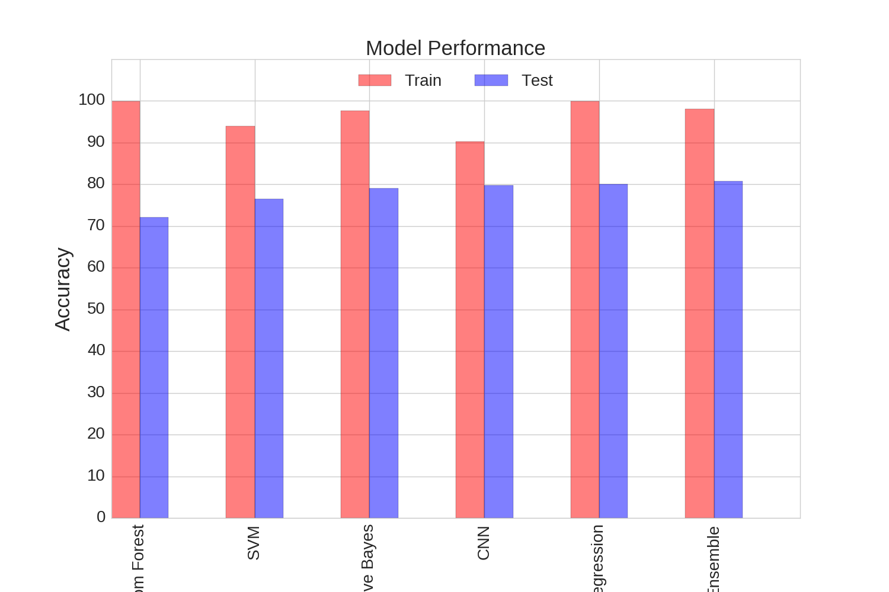
 

## Model Investigation
#### Vocabulary Frequency
Any good Natural Language Processing project should have at least one word cloud
for the vocabulary frequency.  This project is no exception.  It is worth noting
that the word frequencies used in this word cloud were obtained by omitting English
stop words and bigrams in the vectorization process.  The reason I mention this
is because the models performed better without stop word omissions, and as such,
no stop words were omitted in the vectorization used in the models.

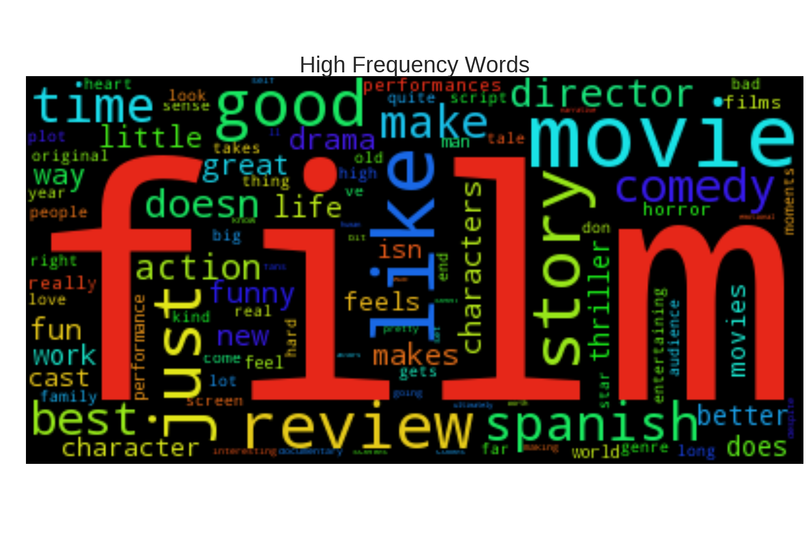
 

The word cloud above shows vocabulary that one might expect for a corpus of movie
reviews.  Words like 'film', 'movie', 'review', and 'director' appear.  In the
next section, I discuss the results of my investigation into the relationship between
vocabulary frequency and predicted sentiment.

#### Frequency - Sentiment Correlation?
One of the first questions I asked once the final model had been trained is
whether or not there is a correlation between vocabulary frequency and
vocabulary sentiment.  The plot below shows a linear regression on top of a
random sample of 10,000 vocabulary elements plotted against their corresponding
sentiment.  As shown, the R^2 value is minimal which demonstrates that virtually
no correlation exists.

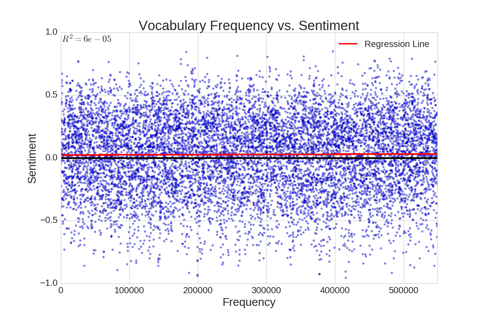
 

#### Vocabulary Sentiment
Up to this point, the manner in which vocabulary sentiment is actually quantified has
not been discussed.  Since the movie reviews have binary data labels, the sentiment
prediction model is a classifier rather than a regressor, which would be used on
continuous data labels.  A property of classifiers is that they can predict the probability
that the input data belongs to any of the labeled classes.  For the case of binary data,
the model predicts the probability that an input data point is equal to zero (negative review)
or equal to one (positive review).  The predicted probability of a value of one can be interpreted
as a quantification of sentiment.  The higher the probability that an input data point has
a value of one, the more positive the sentiment for that review is.  For clarity, the predicted
probability of a value of one is mapped to the range of -1 to 1, so that data with positive
sentiment is represented by a positive number and data with negative sentiment is represented
by a negative number.

##### High Sentiment Words
At this point, you're probably bored with the technical jargon, and you're wondering what
the highest sentiment words in the corpus vocabulary are.  The word cloud below illustrates
exactly that.  The information necessary to create the next four word clouds was obtained by
predicting the sentiment on the entire vocabulary set, and then extracting the most polarizing elements.  
Intuitively, this collection of words make sense.  One would expect words like 'gripping',
'entertaining', and 'beautifully' to be associated with positive sentiment.

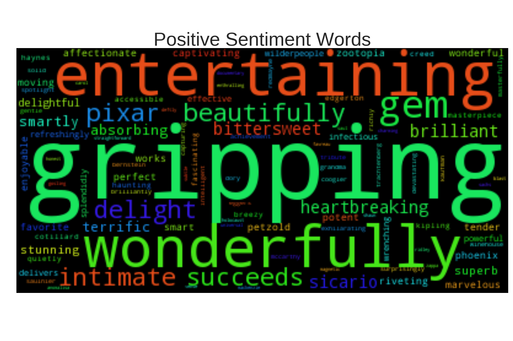
 

##### High Sentiment Bigrams
Now you're probably wondering what the highest sentiment bigrams in the corpus vocabulary are.
I've got you covered.  This next word cloud is of the highest sentiment bigrams in the vocabulary.
Notice that at least one of the high sentiment words from the previous word cloud appears in almost
every single high sentiment bigram.

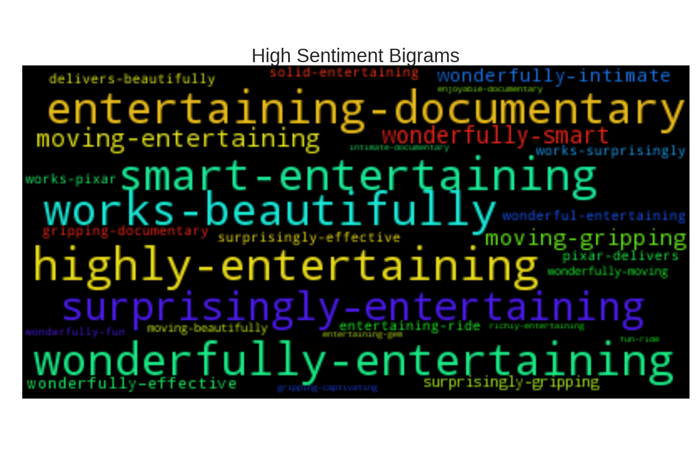
 

##### High Sentiment Vocabulary
The next question you're probably asking is whether individual words or bigrams induce higher sentiment.
As it turns out, high sentiment bigrams yield significantly higher sentiment than high sentiment words.
The bar chart below illustrates this.  The green bars represent the top five highest sentiment bigrams,
and the blue bars represent the top five highest sentiment words.  Notice that every single one of the
top five bigrams contains at least one of the top five words.

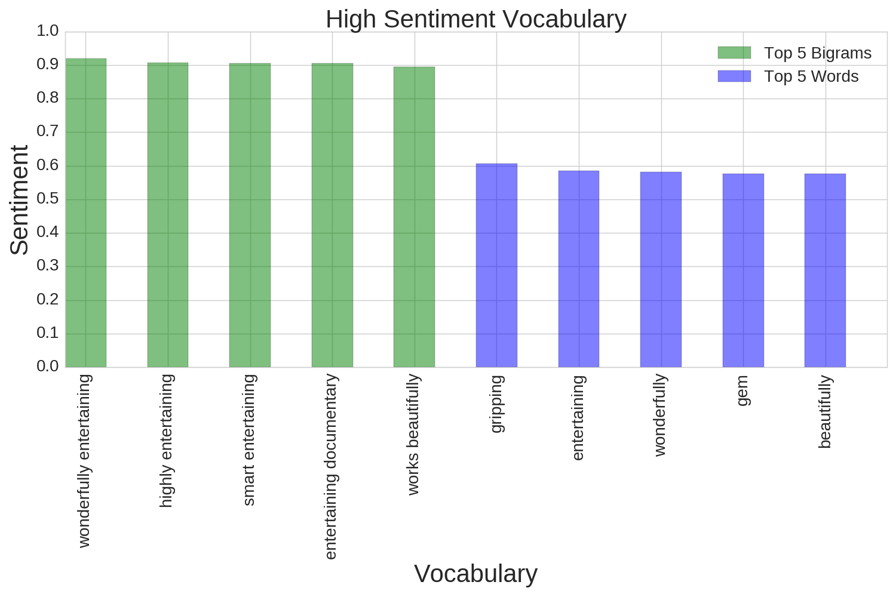
 

##### Low Sentiment Words
Now that we've examined high sentiment vocabulary, let's take a look at the low sentiment vocabulary, starting
with low sentiment words.  Once again, the words in this collection are fitting.  'Bland', 'tedious', and 'pointless'
are all words that are associated with negative sentiment.

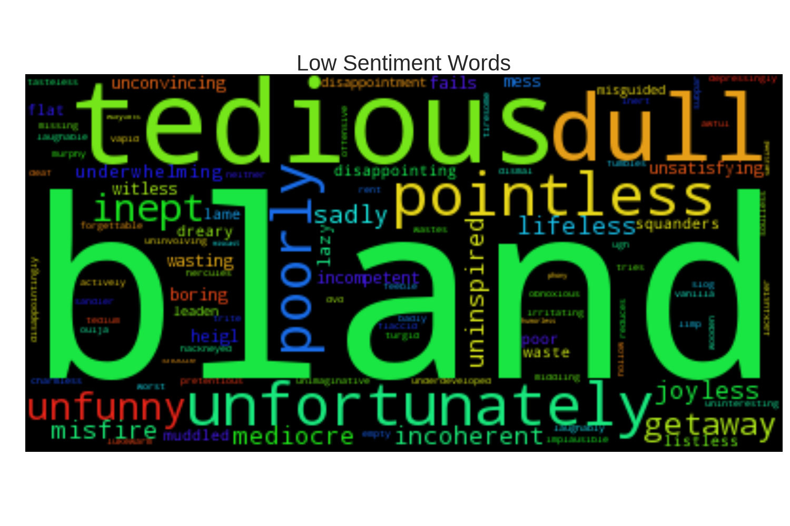
 

##### Low Sentiment Bigrams
Next we have low sentiment bigrams.  Notice that the behavior here is very similar to that of the high sentiment
bigrams in the sense that almost all of the low sentiment bigrams shown below contain at least one of the low
sentiment words from the previous word cloud.

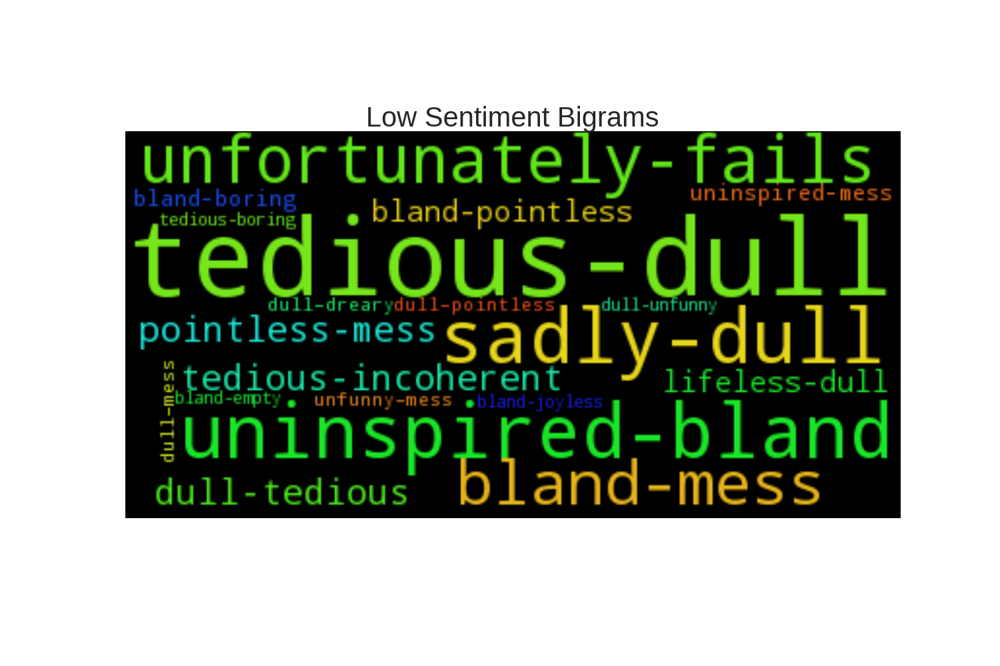
 

##### Low Sentiment Vocabulary
The bar chart below compares the five bigrams with the lowest sentiment to the five words with the lowest sentiment,
bigrams being labeled with red bars, and words being labeled with yellow bars.  Similar to the high sentiment
vocabulary, low sentiment bigrams are significantly more polarizing than low sentiment words.  Also similar to
the high sentiment vocabulary, all five low sentiment bigrams contain at least one of the five low sentiment words.

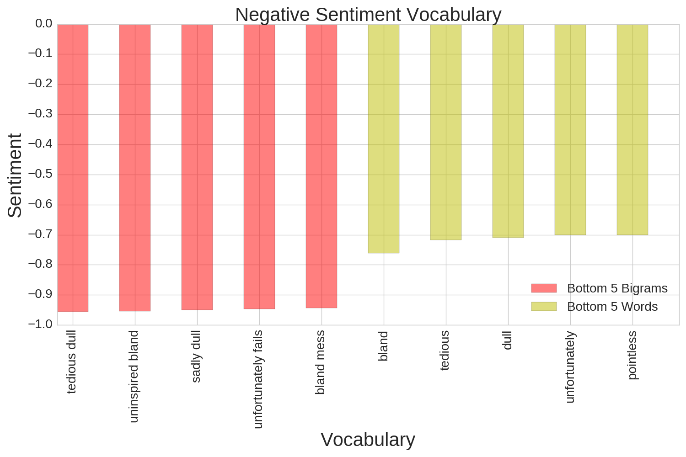
 

#### Sentiment Density Functions
##### Vocabulary Sentiment Density Function
As discussed in the previous section, the sentiment for all the words in the vocabulary was
calculated using the ensemble model.  I thought it would be interesting to examine what the
probability distribution of the vocabulary sentiment would look like, and those results are
displayed in the chart below.  A histogram for vocabulary sentiment is labeled by the blue
bars, the Kernal Density Estimator (KDE) is labeled by the red curve, and a normal distribution
with the mean vocabulary sentiment and standard deviation of the vocabulary sentiment is
labeled with the green curve.  Notice that the KDE and histogram both favor positive sentiment.
Also notice that the KDE is approximately normal away from the mean, but some noise exists
near the mean which causes it to deviate from the normal distribution.

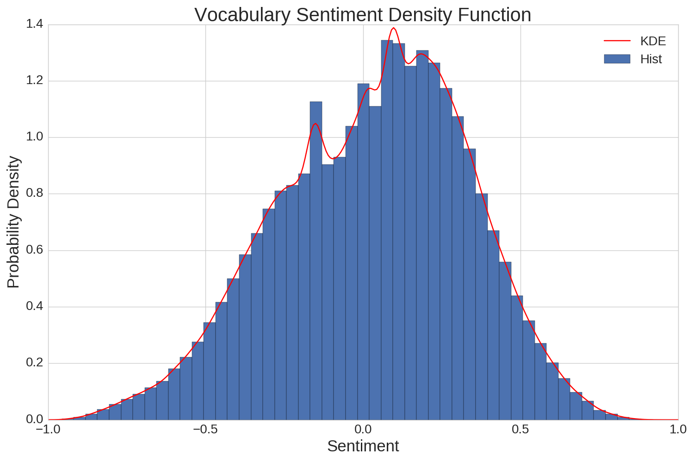
 

##### Corpus Sentiment Density Function
The plot below shows a histogram and KDE for the sentiment of all the reviews in the corpus.
Clearly, the reviews have much more polarizing sentiment than the vocabulary.  Considering
the fact that the model was trained on binary data, this makes sense.  Notice that the
review sentiment favors positive sentiment.  This is most likely due to the fact that the
training data set was imbalanced.  Roughly 58% of the reviews were positive, and that imbalance
is expressed in the density function.

 

##### Sentiment Density Functions
This last density function plot shows both the vocabulary sentiment KDE and the corpus sentiment KDE.
In both cases, positive sentiment is favored.  For the case of the corpus sentiment, the reason
for this is that the corpus was imbalanced in favor of positive reviews.  My suspicion is that the noise and
positive sentiment favoritism in the vocabulary is a manifestation of the imbalance in the corpus sentiment.

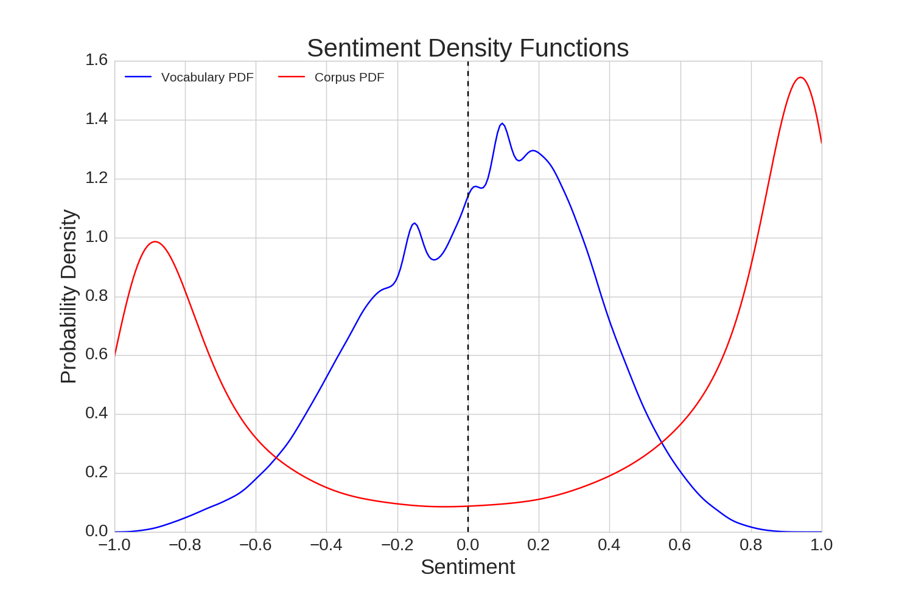
 

## Tomato, Tomauto
Now we're back to where it all started.  How does the Tomautometer stack up against the Tomatometer?
The plot below compares the two for the 2017 Best Picture Oscar Nominees.  As you can see, it did fairly well,
but the model tended to under-predicted, with a mean error of -3.89.

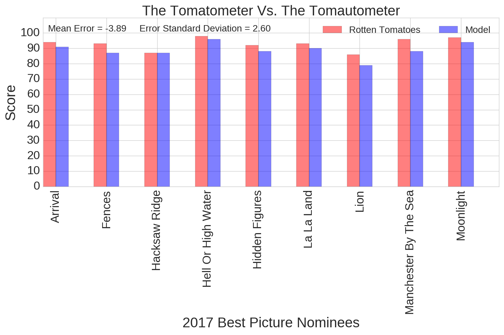
 

This next plot shows the error distribution for all the movies in the data set.  It should be stated that this chart
contains both training and testing data, so it does not give a pure measurement of test error.  Having said that,
it is interesting to notice that similar to the case of the Best Picture Nominees, the model tends to under-predict
the Rotten Tomatoes score with a mean error of -1.42.  The standard error deviation is calculated to be 7.1 because
there were a small number of cases where the model score was significantly different from the Rotten Tomatoes score.
However, the Kernal Density Estimator, shown in red, compared to the normal distribution, shown in green,
indicate that eliminating the outlying error values yields an error distribution that is approximately normal with
a smaller standard deviation than 7.1.

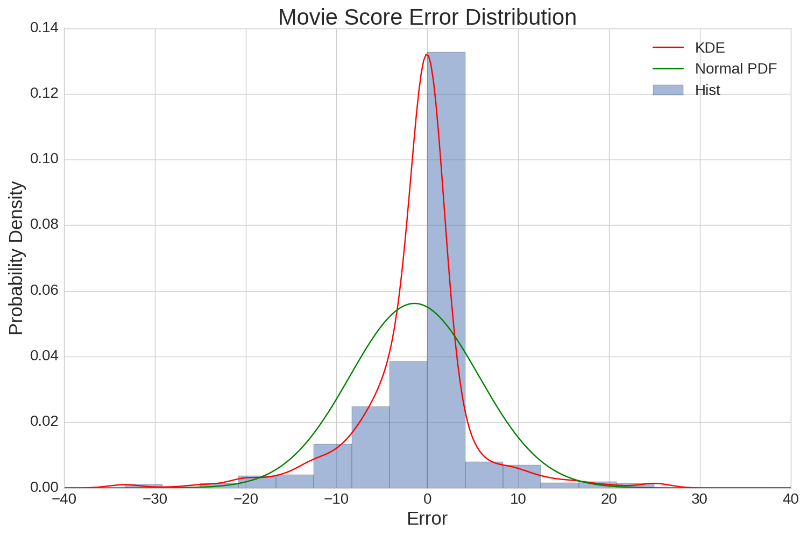
 

## Technology Stack

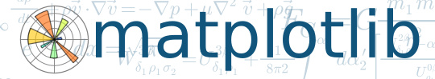

